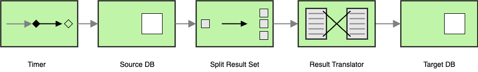

# Apache Camel with Testcontainers
## Introduction
[Apache Camel](https://camel.apache.org/) is a robust integration framework built on well-known Enterprise Integration Patterns (EIPs). It offers a straightforward API to connect diverse systems and applications.

Testing integration routes is vital to ensure seamless functionality, but it often involves external dependencies like databases, web services, or message brokers, making it challenging. [Testcontainers](https://testcontainers.com/) addresses this problem by providing lightweight, disposable [Docker](https://www.docker.com/) containers for such dependencies.

This project demonstrates how to combine Apache Camel with Testcontainers to test integration routes effectively.

## Use Case
Imagine a messaging platform for universities to communicate with applicants. Messages are stored in a database, and at the end of each year, they must be archived. This process involves:

* **Reading messages** from the active database.
* **Transforming data** as needed.
* **Storing the transformed data** into archive database.

The integration route implementing this process needs thorough testing to ensure reliability. Using **Apache Camel** and **Testcontainers**, we can achieve this seamlessly.

## Architecture
This application operates as a command-line tool, executable manually or via a scheduled cron job. The workflow involves the following steps:

1. The [Timer Component](https://camel.apache.org/components/4.8.x/timer-component.html) triggers the process.
2. Data is extracted from the source database using the [JDBC component](https://camel.apache.org/components/4.8.x/jdbc-component.html).
3. Extracted data is transformed or extended.
4. Transformed data is loaded into the target database using JDBC component.



Once the process completes, the application exits. Both the source and target databases use [PostgreSQL](https://www.postgresql.org/).

## Implementation
For database interaction, the **Camel JDBC** component is used. This component sends SQL queries in the message body to the source database, processes the results, and returns them in the message body.

Here’s a simplified route implementation for the archiving process:
```java
from("timer://load-applicant")
    .routeId("applicant-route")
    .setBody()
        .simple(getTemplate("source-query.sql"))
    .to("jdbc:source")
    .split(body())
    .process(this::transform)
        .setHeaders(getExpressions("target-query.sql"))
        .setBody(constant(getTemplate("target-query.sql")))
    .to("jdbc:target");
```
* **Timer**: Triggers the process.
* **JDBC Source**: Reads data from the source database.
* **Split**: Breaks out the list of records into a series of individual ones, each containing data related to one item; it uses the [Split EIP](https://camel.apache.org/components/4.8.x/eips/split-eip.html).
* **Transform**: Processes and modifies the data; it uses the [Message Translator EIP](https://camel.apache.org/components/4.8.x/eips/message-translator.html).
* **JDBC Target**: Writes data to the target database.

**Note**: SQL commands can include raw SQL or parameterized SQL templates.

How the data is exchanged between components is crucial. The Camel API uses Message Exchange Patterns (MEP) to define messaging styles, such as one-way or request-reply.
The Camel Exchange API provides methods to access messages:
* `getIn()` retrieves the IN message.
* `getOut()` retrieves the OUT message (if applicable).

In our case the message is a list of records, which is then split and processed individually, and the exchange of a record looks like this:
```java
void transform(Exchange exchange) {
    Map<String, Object> sourceData = exchange.getIn().getBody(Map.class);
    sourceData.put("archiving_time", LocalDateTime.now());
    sourceData.put("year", year);
}
```
where the `sourceData` is a map of the read fields, and we extend it with additional fields like `archiving_time` and `year`.

## Quarkus Integration
This project leverages [Quarkus](https://quarkus.io/), which simplifies integration with Apache Camel. 

## Testing
Testing is achieved using `QuarkusTestResource`, with implementations wrapping [PostgreSQLContainer](https://java.testcontainers.org/modules/databases/postgres/) from Testcontainers. The container’s lifecycle is managed automatically. For example the source database container creation and initialization is done as follows:
```java
public PostgresSourceDatabaseTestResource() {
    var dockerImageName = DockerImageName.parse("postgres").withTag("15.0");
    container = new PostgreSQLContainer<>(dockerImageName)
        .withExposedPorts(getDbPort())
        .withDatabaseName(getDbName())
        .withUsername(getDbUser())
        .withPassword(getDbPassword())
        .withClasspathResourceMapping("init-source-db.sql", "/docker-entrypoint-initdb.d/init-source-db.sql", BindMode.READ_ONLY)
        .withLogConsumer(new Slf4jLogConsumer(logger)).waitingFor(Wait.forListeningPort());
}

public Map<String, String> start() {
    container.start();
    return Map.of("quarkus.datasource.source.jdbc.url", container.getJdbcUrl(), "timer.period", "100", "timer.delay", "0");
}

public void stop() {
    if (container != null) {
        container.stop();
    }
}
```
By annotating any test class within the module with `@QuarkusTestResource(PostgresSourceDatabaseTestResource.class)`, the container starts automatically before tests execute. The same approach is used for the target database. For example testing the database connections:
```java
@QuarkusTest
@QuarkusTestResource(PostgresSourceDatabaseTestResource.class)
@QuarkusTestResource(PostgresTargetDatabaseTestResource.class)
class DatabaseConnectionTesterTest {

    @Inject
    DatabaseConnectionTester databaseConnectionTester;

    @Test
    void checkConnectionTestRoutesEndpoint() {
        var routeDefinitions = databaseConnectionTester.getRouteCollection().getRoutes();
        assertThat(routeDefinitions.stream()
            .map(RouteDefinition::getEndpointUrl)
            .anyMatch("timer:source-database-test?delay=-1&repeatCount=1"::equals)).isTrue();
        assertThat(routeDefinitions.stream()
            .map(RouteDefinition::getEndpointUrl)
            .anyMatch("timer:target-database-test?delay=-1&repeatCount=1"::equals)).isTrue();
    }
}
```

## Building the project
### Prerequisites
- Java 21
- Maven 3
- Docker

### Build and Test
Run the following command to build the project and execute tests:
```shell
mvn clean verify
```

# Limitations
Current implementation does not support batch processing, and it is executed in a single transaction.
This can lead not to load all data if the data set is too large. To mitigate this, the data set can be split into smaller chunks. For example the message result data can be split by the ID:
```sql
SELECT m.id, m.a_id, a.app_id, d.code d_code, u.code u_code, m.subject, m.text_msg,
       m.read_time, m.creation_time
FROM APPLICANT_MESSAGE m, APPLICANT a, UNIVERSITY u, DEPARTMENT d
WHERE a.id = m.a_id AND a.u_id = u.id AND a.d_id = d.id
ORDER BY m.id
LIMIT 10000 OFFSET 0
```
Increase the `OFFSET` incrementally (e.g., by 10,000) until all data is processed.

This project demonstrates a practical approach to testing and implementing integration routes using Apache Camel and Testcontainers, offering scalability and reliability for modern integration needs.
